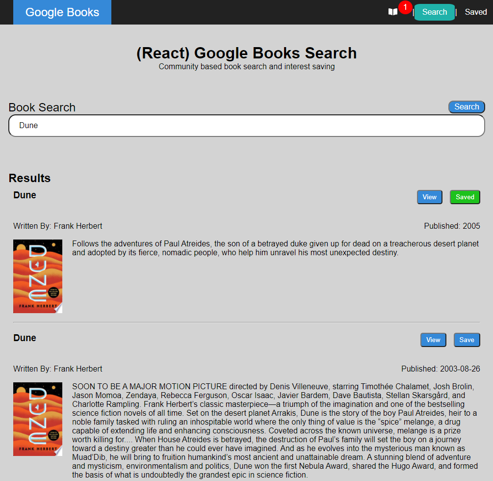

# React Book Search
[](https://opensource.org/licenses/ISC)

[Live Site - https://zar-google-books.herokuapp.com/](https://zar-google-books.herokuapp.com/)

## Description
A MERN site to manage interactions with googleBooks. The site also includes socketIO for a notification system displaying information when other users make changes to the database.



## Table of Contents

1. [Installation](#1-installation)
2. [Usage](#2-usage)
3. [License](#3-license)
4. [Contributing](#4-contributing)
6. [Questions](#5-questions)

## 1 Installation
1. Download repository
	```
	HTTPS: Git clone https://github.com/Zarlengo/Google-Books.git
    SSH: Git clone git@github.com:Zarlengo/Google-Books.git
	```

2. Install dependencies
	```
	npm install
	```

3. Ensure a MongoDB server is running

3. Start the server
    ```
    npm run start
    ```

4. Navigate to localhost:3000
    You can now view googleBookSearch in the browser.

    [Local:            http://localhost:3000/](http://localhost:3000)

5. To use the site without a node server. Creates a build folder with html/css/js files
    ```
    npm run build
    ```

## 2 Usage


#### Search


Books can be searched for by entering in some keywords into the `Book Search` input and then pressing the `Search` Button


* Book title
* Author
* Publication Date
* Book Description
* `View` button to open to the books.google page for the book
* `Save` button to place the book into the database for future usage. Name changes to `Saved` once clicked


***

#### Saved


Listings of saved books for review.
* `View` button will open the books.google link
* `Delete` button will remove the book from the page

***

#### Notifications


* When a use adds or removes a book from the system, the notification counter will increase.
* Hovering over the notification icon will show the recent changes.
* Clicking on the icon will remove the history.
* NOTE: Notifications persists through leaving the site and returning. It does not add changes happening when not on the site.


## 3 License
    Copyright © 2020 Chris Zarlengo
    Permission to use, copy, modify, and/or distribute this software for any
    purpose with or without fee is hereby granted, provided that the above
    copyright notice and this permission notice appear in all copies.

    THE SOFTWARE IS PROVIDED "AS IS" AND THE AUTHOR DISCLAIMS ALL WARRANTIES
    WITH REGARD TO THIS SOFTWARE INCLUDING ALL IMPLIED WARRANTIES OF
    MERCHANTABILITY AND FITNESS. IN NO EVENT SHALL THE AUTHOR BE LIABLE FOR ANY
    SPECIAL, DIRECT, INDIRECT, OR CONSEQUENTIAL DAMAGES OR ANY DAMAGES
    WHATSOEVER RESULTING FROM LOSS OF USE, DATA OR PROFITS, WHETHER IN AN ACTION
    OF CONTRACT, NEGLIGENCE OR OTHER TORTIOUS ACTION, ARISING OUT OF OR IN
    CONNECTION WITH THE USE OR PERFORMANCE OF THIS SOFTWARE.

## 4 Contributing
* [Zarlengo](https://github.com/Zarlengo)

## 5 Questions
* [Github Profile for Zarlengo](https://github.com/Zarlengo)
* [Send email to christopher@zarlengo.net](mailto:christopher@zarlengo.net)
* [File an issue](https://zar-google-books.herokuapp.com/issues)
